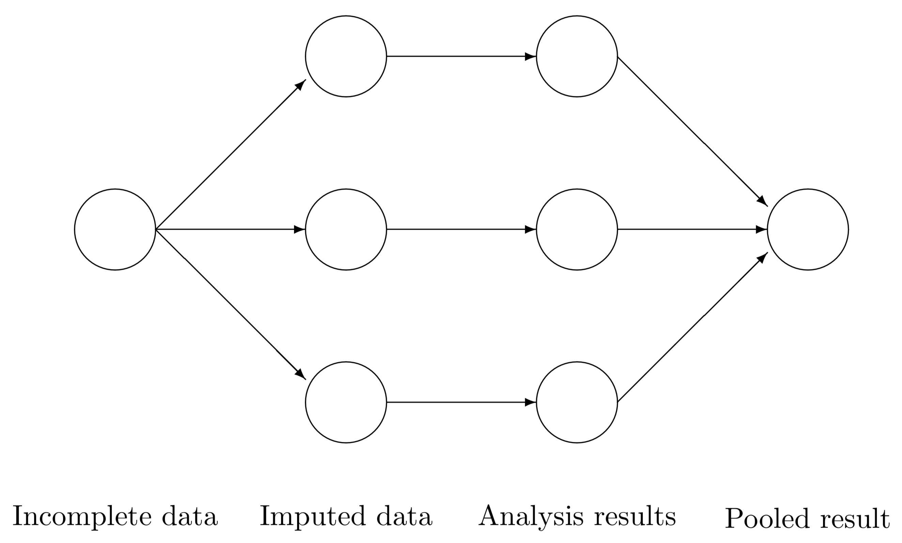

# Minería de Datos

## Motivación para la Minería de datos

* Los métodos de recolección de datos han evolucionado muy rápidamente.
* Las bases de datos han crecido exponencialmente
* Estos datos contienen información útil para las empresas, países, etc..
* El tamaño hace que la inspección manual sea casi imposible
* Se requieren métodos de análisis de datos automáticos para optimizar el uso de estos enormes conjuntos de datos

## ¿Qué es la minería de datos?

Es el análisis de **conjuntos de datos** (a menudo grandes) para encontrar **relaciones insospechadas** (conocimiento) y resumir los datos de **formas novedosas** que sean **comprensibles y útiles** para el propietario/usuario de los datos.

<p style='text-align: right;'> Principles of Data Mining (Hand et.al. 2001) </p>

## Datos y conocimiento

### Datos:

* se refieren a instancias únicas y primitivas (single objetos, personas, eventos, puntos en el tiempo, etc.)
* describir propiedades individuales
* a menudo son fáciles de recolectar u obtener (por ejemplo, cajeros de escáner, internet, etc.)
* no nos permiten hacer predicciones o pronósticos

### Conocimiento:

* se refiere a clases de instancias (conjuntos de ...)
* describe patrones generales, estructuras, leyes,
* consta de la menor cantidad de declaraciones posibles
* a menudo es difícil y lleva mucho tiempo encontrar u obtener
* nos permite hacer predicciones y pronósticos

## Requerimientos

* Disponibilidad para aprender 
* Mucha paciencia
    - Interactúa con otras áreas
    - Preprocesamiento de datos 
* Creatividad
* Rigor, prueba y error

## knowledge discovery in databases (KDD)


## Preparación de los datos

### Recopilación

* Instituto de Estadística 
* UDAPE, ASFI 
* Ministerio Salud (SNIS), Ministerio de educación (SIE)
* APIs, Twitter, Facebook, etc.
* Kaggle
* Banco Mundial, UNICEF, FAO, BID (Open Data)

### Data Warehouse


### Data Warehouse in R


### Importación

```{r, echo=T,eval=F}
library(foreign)
library(readr)
apropos("read")
getwd()
setwd("C:\\Users\\ALVARO\\Downloads\\bd49 (1)\\Base EH2019")
dir()
eh19v<-read.spss("EH2019_Vivienda.sav",to.data.frame = T)
eh19p<-read.spss("EH2019_Persona.sav",to.data.frame = T)
object.size(eh19p)/10^6
#exportación de datos
setwd("C:\\Users\\ALVARO\\Documents\\GitHub\\EST-384\\data")
save(eh19p,eh19v,file="eh19.RData")
# cargando la base de datos que acabamos de guardar
rm(list=ls())
load("eh19.RData")
load("oct20.RData")
# cargando desde github
rm(list=ls())
load(url("https://github.com/AlvaroLimber/EST-384/raw/master/data/eh19.RData"))
load(url("https://github.com/AlvaroLimber/EST-384/raw/master/data/oct20.RData"))
```

### Recopilación

```{r,echo=T,eval=F}
read.table("clipboard",header = T)
library(readxl) # excel 
library(DBI)  # Bases de datos relacionales en el sistema
#library(help=DBI)  
library(RMySQL) # bases de datos en mysql
# web scraping (API)
library(gtrendsR) # API
gg<-gtrends(c("data mining","machine learning"),time="today 12-m")
gg$interest_over_time
plot(gg)
gg<-gtrends(c("data mining","machine learning"),time="today 12-m",geo="BO")
```

### Limpieza

```{r,echo=T}
std<-data.frame(name=c("ana","juan","carla"),math=c(86,43,80),stat=c(90,75,82))
std
```

```{r,echo=T}
library(tidyr)
bd<-gather(std,materia,nota,math:stat)
bd
```

### Ejercicio (reshape)

http://www.udape.gob.bo/portales_html/dossierweb2019/htms/CAP07/C070311.xls

###  Limpieza (fechas)

```{r,echo=T}
library(lubridate)
ymd("20151021")
ymd("2015/11/30")
myd("11.2012.3")
dmy_hms("2/12/2013 14:05:01")
mdy("120112")
```

### Limpieza (String)

```{r,echo=TRUE}
toupper("hola")
abc<-letters[1:10]
toupper(abc)

tolower("HOLA")
tolower("Juan")

substr("hola como estan",1,3)
substr("hola como estan",3,7)
nchar("hola")
gsub("a","x","hola como estas")
grepl("a",c("hola","como"))
grepl("o",c("hola","como"))
library(stringi)
```

### Transfomración

* Estandarizar variables
* Función logarítmo
* Creación de variables
* Recodificar variables

## Imputación de variables 

**We should be suspicious of any dataset (large or small) which appears perfect.**

— David J. Hand

### La falta de información es información

* MCAR missing completely at random 
* MAR missing at random 
* MNAR missing not at random 

### Aproximación formal
Sea $Y$ una matriz de datos con $n$ observaciones y $p$ variables. Sea $R$ una matriz de respuesta binaria, tal que si $y_{ij}$ es observada, entonces $r_{ij}=1$.

Los valores observados son colectados en $Y_{obs}$, las observaciones perdidas en $Y_{mis}$. Así, $Y=(Y_{obs},Y_{mis})$.

La distribución de $R$ depende de $Y=(Y_{obs},Y_{mis})$. Sea $\psi$ que contiene los parametros del modelos de los datos perdidos, asi la expresion del modelo de los datos perdidos es $\Pr(R|Y_\mathrm{obs},Y_\mathrm{mis},\psi)$

### MCAR, MAR, MNAR

MCAR (missing completely at random )
$$
\Pr(R=0|{\mbox{$Y_\mathrm{obs}$}},{\mbox{$Y_\mathrm{mis}$}},\psi) = \Pr(R=0|\psi)
$$

MAR (missing at random )
$$
\Pr(R=0|{\mbox{$Y_\mathrm{obs}$}},{\mbox{$Y_\mathrm{mis}$}},\psi) = \Pr(R=0|{\mbox{$Y_\mathrm{obs}$}},\psi) 
$$

MNAR (missing not at random )
$$
\Pr(R=0|{\mbox{$Y_\mathrm{obs}$}},{\mbox{$Y_\mathrm{mis}$}},\psi)
$$

### Alternativas para trabajar con los Missings (Ad-hoc)

* Listwise deletion 
* Pairwise deletion
* Mean imputation
* Regression imputation
* Stochastic regression imputation
* Last observation carried forward (LOCF) and baseline observation carried forward (BOCF) 
* Indicator method

### Imputación Multiple

{width=800px}


### Patrones en datos multivariados

{width=800px}


### Influx and outflux

$$
I_j = \frac{\sum_j^p\sum_k^p\sum_i^n (1-r_{ij})r_{ik}}{\sum_k^p\sum_i^n r_{ik}}
$$

La variable con mayor influx está mejor conectada a los datos observados y, por lo tanto, podría ser más fácil de imputar.

$$
O_j = \frac{\sum_j^p\sum_k^p\sum_i^n r_{ij}(1-r_{ik})}{\sum_k^p\sum_i^n 1-r_{ij}}
$$
La variable con mayor outflux está mejor conectada a los datos faltantes, por lo tanto, es potencialmente más útil para imputar otras variables.

### Imputación de datos monótonos


### Multivariate Imputation by Chained Equations (mice)
(Imputación multivariante por ecuaciones encadenadas)

